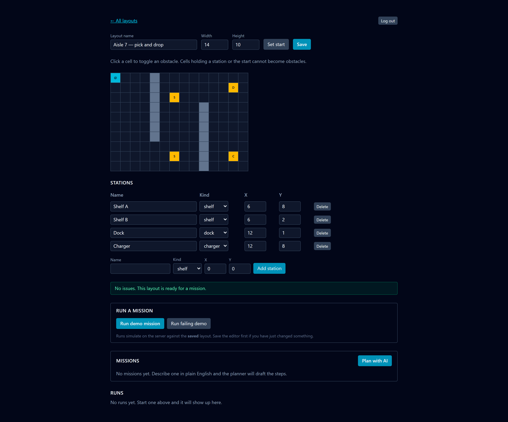
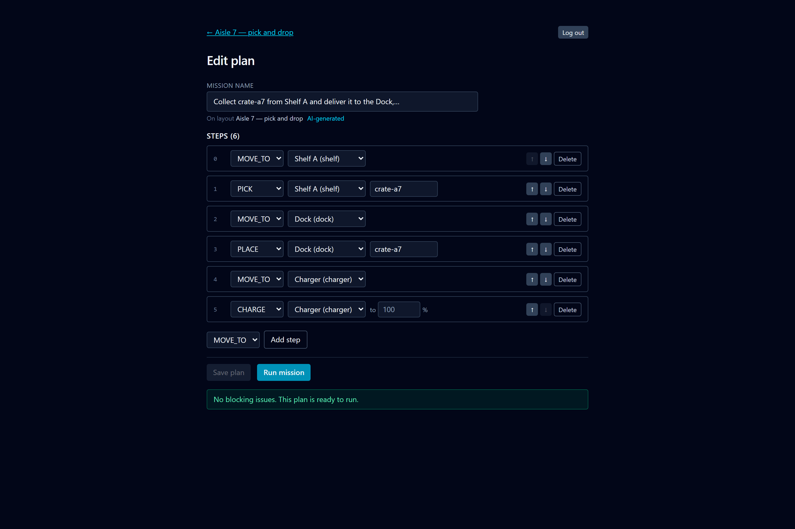
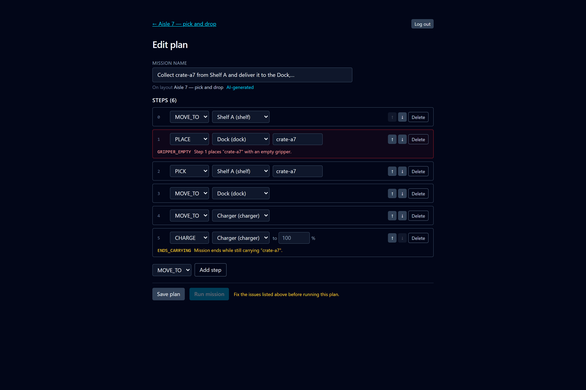
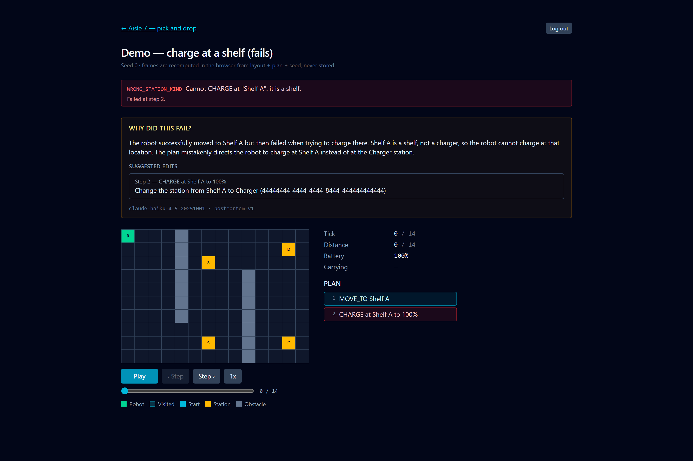

# Robot Mission Studio

[](https://github.com/msrodek5/robot-mission-studio/actions/workflows/ci.yml)

Describe a warehouse robot's job in plain English — "fetch the crate from Shelf A
and leave it at the dock" — and Robot Mission Studio turns it into a structured
mission plan, checks that plan against the floor you drew, runs it on a
deterministic grid simulation, and replays the result frame by frame with a
scrubber. When a run fails it does not just show you a red banner: it names the
failing step, the failure class, and asks a model to explain in plain language
what went wrong and which steps to change. Draw a layout, plan a mission, watch
it work — or watch it fail and find out why.


**Live:** <https://robot-mission-studio.vercel.app>

<table>
<tr>
<td width="50%"><a href="./docs/screenshots/01-layout-editor.png"></a><br><strong>Draw the floor.</strong> Click cells to toggle obstacles, add stations, set the start. The validator runs on every keystroke.</td>
<td width="50%"><a href="./docs/screenshots/03-plan-editor.png"></a><br><strong>Plan it in English.</strong> "Collect crate-a7 from Shelf A and deliver it to the Dock, then top the battery up at the Charger" became these six steps.</td>
</tr>
<tr>
<td width="50%"><a href="./docs/screenshots/04-plan-editor-linter.png"></a><br><strong>The linter blocks the run, not the save.</strong> A <code>PLACE</code> moved above its <code>PICK</code> is caught on the step that caused it, and Run says why it is disabled.</td>
<td width="50%"><a href="./docs/screenshots/08-failure-postmortem.png"></a><br><strong>Failures explain themselves.</strong> <code>WRONG_STATION_KIND</code> at step 2, then a diagnosis and an anchored fix — generated once and cached on the run row.</td>
</tr>
</table>

Every image above is a real capture against the production build, with real model
calls. Regenerate them after a UI change with `node scripts/screenshots.mjs`.

Capstone project for 10xDevs 3.0. Product definition in [`.ai/prd.md`](./.ai/prd.md),
stack rationale in [`.ai/tech-stack.md`](./.ai/tech-stack.md), build order and
what actually happened in
[`.ai/robot-mission-studio-implementation-plan.md`](./.ai/robot-mission-studio-implementation-plan.md).

## Architecture

- **Astro 7 with React islands, rendered on demand.** Pages and `/api/*`
  endpoints live together in `src/pages`; only the interactive parts
  (editor, plan list, player) ship JavaScript. The landing page is the one
  prerendered route.
- **`src/lib/sim` is a pure TypeScript module with zero dependencies.** `simulate()`
  and `validateMission()` run unchanged in the browser and on the server — see
  [Determinism](#determinism) below, which is the reason the rest of the design
  looks the way it does.
- **Supabase for Postgres, Auth, and row-level security.** Three tables
  (`layouts`, `missions`, `runs`), each with an ownership policy; another user's
  row is invisible rather than forbidden, so the app answers 404 and never 403.
  The service-role key never reaches anything that ships to a browser.
- **Anthropic for the two AI features**, both server-side: a planner
  (brief → `Mission`) and a postmortem (failed run → diagnosis). Every response
  parses through Zod, then through `validateMission()`, with a bounded repair
  loop; nothing constructs a `Mission` from raw model text.
- **Vercel for hosting, GitHub Actions for the gate.** Vercel's Git integration
  builds a preview per pull request and production on `main`; this repo's CI runs
  typecheck, lint, unit tests with coverage, the build, and the Playwright suite.

## Determinism

`simulate(layout, mission, opts)` is a pure function. No clock, no
`Math.random()`, no network, no environment access, no logging. Randomness — when
it eventually arrives — comes only from a seeded RNG passed in `SimOptions`, and
`seed` has been in that signature since day one so adding stochastic events will
not break a single existing test. A* breaks ties on `(f, h, x, y)` for the same
reason: without a total order on the open set, two runs of the same mission can
take different equal-length paths, and every snapshot in the suite would flake.

That single constraint pays for itself three times over:

1. **One implementation, two runtimes.** The same function runs in the browser
   for playback and on the server for persisted runs. No drift between a preview
   and the real thing, and no round-trip per frame.
2. **Frames are never stored.** `layout + mission + seed` fully determines a run,
   so the database holds the log and the outcome, and the browser recomputes the
   animation. The player goes further and *checks* this: it compares its own
   recomputed status and tick count against the persisted row, and if they
   disagree it refuses to animate and says so, because a plausible-looking replay
   of the wrong run is worse than no replay at all.
3. **Golden-file testing works.** Fixtures in `tests/fixtures/` go through
   `simulate()` and snapshot the whole `RunResult` minus `frames`. That is a
   cheap, high-signal test that is only possible because the answer is the same
   every time — and it is what would catch accidental nondeterminism the moment
   it is introduced.

## Testing

| Suite | Command | What it covers |
| --- | --- | --- |
| Unit + golden | `npm test` | The sim core, validators, schemas, and the LLM parsing layer. Offline, no mocking framework, ~300 tests. |
| Negative RLS | `npm run test:rls` | Two real users over the anon key, proving neither can see the other's rows. Needs a live Supabase project, so it is not in `npm test`. |
| E2E | `npm run test:e2e` | Four browser flows against the **production build**. |
| Repo rules | `npm run lint` | The `CLAUDE.md` non-negotiables: no `any`, no `@ts-ignore`, no non-null assertions outside tests, and no import escaping `src/lib/sim`. |

**Coverage is concentrated on the sim core on purpose, and that is a claim rather
than an accident.** Coverage is measured over `src/lib/**` only; `src/pages` and
`src/components` are excluded. The reason is what each kind of bug looks like
when it happens. A broken page is loud — nothing renders, the button does
nothing, and you find out in ten seconds. A broken simulator is silent: it
produces a run that looks entirely plausible, animates smoothly, reports a tick
count, and is wrong. Nothing but a test catches that. So the tests go where the
failures hide, and the CI job summary reports the sim core's line coverage
separately from everything else rather than averaging the two into a number that
describes neither.

The pages are covered by the four E2E flows instead, and where the two overlap
the E2E suite is deliberately the thinner one:

1. `happy-path.spec.ts` — draw a layout with obstacles, two stations and a start;
   save; reload; assert it renders identically; generate a mission from a brief;
   run it; assert playback reaches success with metrics shown.
2. `failure-postmortem.spec.ts` — run the failing demo; assert the failure code
   and the highlighted failing step; ask for an explanation; reload and assert it
   is still there, served from the cache on the run row.
3. `auth-guard.spec.ts` — anonymous visits are redirected to `/login`; user B
   gets **404** for user A's layout, not the layout and not a 403.
4. `plan-editor.spec.ts` — move a `PLACE` above its `PICK`; assert the issue
   appears against that step and Run is disabled *for that reason*; fix the
   order; assert the issue clears and Run comes back.

Two things about the E2E setup are worth knowing before you change it:

- **No test makes a real model call.** Both AI features call Anthropic from
  server code, where `page.route` cannot reach them — and stubbing our own
  endpoints instead would mean the mission row is never written, so the next
  navigation would 404 and the postmortem cache test would have nothing cached.
  So the seam is `ANTHROPIC_BASE_URL`, pointed at
  `tests/e2e/support/anthropic-stub.mjs`. Everything downstream of the model runs
  for real. A `page.route` tripwire fails any test in which the *browser* reaches
  for `api.anthropic.com`.
- **The suite runs against the production build, not `astro dev`.**
  `astro preview` does not work with `@astrojs/vercel`, so
  `tests/e2e/support/serve-build.mjs` boots `.vercel/output` behind a plain
  `node:http` port. Slower to start, and it means the tests exercise the artefact
  that actually ships.

The suite creates two throwaway accounts (`test_e2e_a@example.com`,
`test_e2e_b@example.com`) and deletes them afterwards; `on delete cascade` from
`auth.users` takes their rows with it, and the teardown asserts the row counts
reached zero. Nothing is deleted by table, so **only** those two accounts can
ever be affected — but point it at a project whose data you do not need anyway.

## Local setup

Node 24 (see `.nvmrc`); Astro 7 needs at least 22.12.

```bash
npm install
cp .env.example .env          # then fill it in — see the table below
npm run dev                   # http://localhost:4321
```

To run the whole gate the way CI does:

```bash
npm run typecheck             # astro check
npm run lint                  # the CLAUDE.md standing rules
npx vitest run --coverage     # unit + golden tests, coverage in coverage/
npm run build
npx playwright install --with-deps chromium   # first time only
npm run test:e2e              # builds, boots the build, runs four flows
```

`npm run test:e2e` needs `SUPABASE_SERVICE_ROLE_KEY` (to create and delete its
two test users) and serves the app on port **4331** — deliberately not Astro's
4321, so it can never adopt a dev server you left running.

### Commands

| Command | Does |
| --- | --- |
| `npm run dev` | Local dev server |
| `npm test` | Vitest unit + golden tests |
| `npm run test:rls` | Negative RLS test — needs a live Supabase project |
| `npm run test:e2e` | Playwright, four flows, LLM stubbed |
| `npm run typecheck` | `astro check` |
| `npm run lint` | Repo standing-rules check |
| `npm run build` | Production build into `.vercel/output` |
| `npm run e2e:serve` | Serve an existing build on port 4331 |
| `npx supabase db push` | Apply migrations |

## Environment variables

| Name | Scope | Required | What it is |
| --- | --- | --- | --- |
| `PUBLIC_SUPABASE_URL` | client + server | yes | Supabase project URL. Inlined into the client bundle at build time, so it must be set for `npm run build`, not only at runtime. |
| `PUBLIC_SUPABASE_ANON_KEY` | client + server | yes | Anon key. Safe to expose: it only reaches rows RLS already permits. |
| `SUPABASE_SERVICE_ROLE_KEY` | server / tests only | for `test:rls` and `test:e2e` | Bypasses RLS. The app itself never reads it; the test suites use it only to create and delete their throwaway users. Never import it into anything that ships to a browser. |
| `ANTHROPIC_API_KEY` | server | for the AI features | Missing it is a clean typed `PROVIDER_ERROR` in the UI rather than a 500. |
| `ANTHROPIC_MODEL` | server | no | Defaults to `claude-haiku-4-5`. Planning a six-step errand is not frontier-model work. |
| `ANTHROPIC_BASE_URL` | server | no | Read by the Anthropic SDK. The E2E suite points it at its stub server; leave it unset everywhere else. |
| `E2E_BASE_URL` | tests | no | Defaults to `http://127.0.0.1:4331`. |
| `E2E_STUB_PORT` | tests | no | Port for the stub Anthropic server. Defaults to `4399`. |
| `VERCEL_GIT_COMMIT_SHA` | server | no | Set by Vercel; surfaced by `GET /api/health` as `commit`. |

### CI secrets

The workflow reads four repository secrets and maps them onto the names above.
They should point at a Supabase project whose data is disposable.

| Secret | Maps to |
| --- | --- |
| `E2E_SUPABASE_URL` | `PUBLIC_SUPABASE_URL` |
| `E2E_SUPABASE_ANON_KEY` | `PUBLIC_SUPABASE_ANON_KEY` |
| `E2E_SUPABASE_SERVICE_ROLE_KEY` | `SUPABASE_SERVICE_ROLE_KEY` |
| `E2E_ANTHROPIC_API_KEY` | `ANTHROPIC_API_KEY` — a dummy value. Every model call in CI is answered by the stub, but the SDK will not construct a client without a key. |

## Layout

```
src/pages            routes + server endpoints (/api/*)
src/components       React islands (editor, playback, plan editor)
src/lib/sim          the simulation core — pure, zero dependencies
src/lib/ai           Anthropic client, prompts, Zod schemas, repair loop
src/lib/schemas      Zod schemas — the source of truth for every shared type
src/db               Supabase client, typed queries
supabase/migrations  SQL migrations and RLS policies
scripts              lint-rules.mjs, ci-summary.mjs
tests/unit           Vitest
tests/rls            negative RLS test, run separately
tests/e2e            Playwright: four flows, support/, and the Anthropic stub
tests/fixtures       golden run fixtures and canned LLM responses
```

## Deploy

Vercel's Git integration builds a preview per pull request and production on
`main`. GitHub Actions ([`ci.yml`](./.github/workflows/ci.yml)) is the quality
gate that runs alongside it; both the Playwright HTML report and the coverage
report are uploaded as artifacts on every run, green or red, and kept 30 days.

`GET /api/health` returns `{ status, commit }` and the landing page probes it on
load, so a broken deployment is visible without digging through logs.
